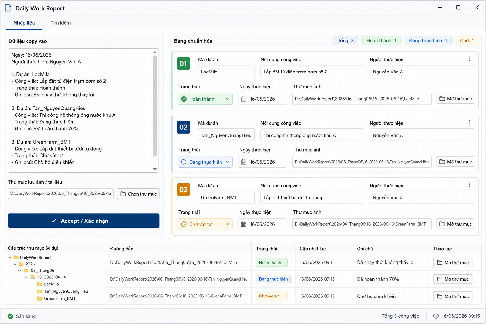

# Ke hoach phan mem bao cao cong viec hang ngay

## 1. Muc tieu

Phan mem dung de nhap nhanh noi dung bao cao cong viec copy tu ben ngoai, tu dong nhan dien cac truong du lieu, chuan hoa thanh form thong nhat, tach theo tung du an, tao thu muc luu anh theo ngay va nguoi thuc hien, dong thoi luu du lieu vao JSON de tim kiem ve sau.

Mockup giao dien tong quat:



## 2. Cac chuc nang chinh

### 2.1 Man hinh nhap lieu

- Vung nhap van ban lon de dan du lieu copy vao.
- Nut `Chon thu muc` de chon thu muc goc luu tru anh va folder theo ngay.
- Hien thi duong dan thu muc da chon.
- Nut `Accept / Xac nhan` de xu ly noi dung.
- Khu vuc preview `Bang chuan hoa` hien thi ket qua da tach.

### 2.2 Chuan hoa du lieu

Moi ban ghi sau khi xu ly can co cac truong:

- `ma_du_an`: mot hoac nhieu ma du an, vi du `AUTM2602E8`, `2602E9`, `MEC2601045`.
- `noi_dung_cong_viec`: danh sach noi dung hoac khoang thoi gian lam viec.
- `nguoi_thuc_hien`: mot hoac nhieu nguoi.
- `trang_thai`: tien do, van de dang xu ly, viec da xong hoac chua xong.
- `ngay_thuc_hien`: ngay/thang/nam theo chuan ISO, vi du `2026-06-11`.
- `thu_muc_luu_anh`: duong dan folder da tao cho tung nguoi.

Neu mot lan nhap co nhieu du an, phan mem tach thanh nhieu vung du an. Neu thong tin chung ap dung cho nhieu du an, phan mem gan lai vao tung du an va cho phep sua tay o preview truoc khi luu.

### 2.3 Nhan dien form sai

Phan mem can co bo parser linh hoat, chap nhan cac cach ghi:

- Co so thu tu `1.`, `2.`, `3.` hoac khong co so.
- Ten truong viet khac nhau: `ma du an`, `ten du an`, `noi dung`, `noi dung CV`, `thuc hien`, `nguoi thuc hien`, `tinh trang`, `thuc trang`, `trang thai`, `ngay thuc hien`.
- Ngay viet dang `11/6/2026`, `thu Nam ngay 11 thang 06 nam 2026`, hoac `ngay 11 thang 6 nam 2026`.
- Ten nguoi co ky tu `@`, dau phay, chu `va`, hoac cau dai co mo ta nhiem vu kem theo.
- Ma du an viet hoa/thap lan lon, co dau `:`, dau `.`, dau `,`, hoac khoang trang.

Khi do tin cay thap, phan mem danh dau can kiem tra bang mau canh bao o bang preview.

### 2.4 Tao folder

Sau khi xac nhan:

- Tao folder ngay theo dang `YYYYMonthDD`, vi du `2026June16`.
- Neu folder ngay da ton tai thi dung lai folder cu, khong tao trung.
- Ben trong folder ngay, tao folder theo ten nguoi thuc hien da chuan hoa khong dau va viet lien, vi du `LocMilo`, `Tan`, `NguyenQuangHieu`.
- Neu nhieu nguoi cung ngay, tat ca cung nam trong cung folder ngay.
- Moi ban ghi JSON luu duong dan folder tuong ung de nut `Mo thu muc` co the mo truc tiep.

### 2.5 Luu JSON

Du lieu nen luu vao file `data/work_reports.json`. Cau truc goi y:

```json
[
  {
    "id": "2026-06-11_AUTM2602E8_001",
    "ma_du_an": "AUTM2602E8",
    "noi_dung_cong_viec": [
      "Boc lai day tin hieu va nguon ket noi may lazer"
    ],
    "nguoi_thuc_hien": [
      "Bui Huu Sy",
      "E Hung Lap Rap",
      "Tan A7"
    ],
    "trang_thai": [
      "Da boc xong day ket noi LD, UL va lazer"
    ],
    "ngay_thuc_hien": "2026-06-11",
    "folder_ngay": "D:/Daily_work_report/2026June11",
    "folder_nguoi": [
      "D:/Daily_work_report/2026June11/BuiHuuSy",
      "D:/Daily_work_report/2026June11/EHungLapRap",
      "D:/Daily_work_report/2026June11/TanA7"
    ],
    "raw_text": "Noi dung goc da nhap",
    "created_at": "2026-06-16T12:00:00+07:00"
  }
]
```

### 2.6 Trang tim kiem

Trang `Tim kiem` can co:

- O tim kiem tong hop: tim theo ma du an, nguoi, noi dung, trang thai, ngay.
- Bo loc nhanh: ngay, thang, nam, nguoi thuc hien, ma du an.
- Bang ket qua gom ma du an, ngay, nguoi, noi dung ngan, trang thai ngan.
- Nut hoac link `Mo thu muc` de mo folder tren may.
- Khi bam vao mot dong ket qua, hien chi tiet day du va noi dung goc.

## 3. Kien truc de xuat

### 3.1 Ban desktop de dung noi bo

Nen lam bang Electron hoac Tauri neu can ung dung desktop co nut mo folder truc tiep, chon thu muc, doc/ghi JSON cuc bo.

De xuat thuc te:

- Frontend: React + TypeScript.
- Desktop shell: Tauri neu muon nhe, Electron neu muon de lam va pho bien hon.
- Luu tru: JSON luc dau, sau co the nang cap SQLite.
- Parser: TypeScript rieng mot module `parser`.
- File system: API cua Tauri/Electron de chon thu muc, tao folder, mo folder.

### 3.2 Cau truc module

- `InputPage`: nhap lieu, chon thu muc, bam xac nhan.
- `PreviewTable`: hien thi bang chuan hoa theo tung du an.
- `SearchPage`: tim kiem va mo folder.
- `reportParser`: tach raw text thanh du lieu co cau truc.
- `dateNormalizer`: chuan hoa ngay tieng Viet va dang so.
- `nameNormalizer`: bo dau, loai ky tu dac biet, tao ten folder.
- `projectNormalizer`: nhan dien va chuan hoa ma du an.
- `storageService`: doc/ghi JSON.
- `folderService`: tao folder ngay, folder nguoi, mo folder.

## 4. Luong xu ly khi bam Accept

1. Doc raw text tu vung nhap.
2. Tach cac section theo so thu tu, tieu de, dau gach dong va tu khoa.
3. Nhan dien ngay thuc hien.
4. Nhan dien ma du an. Neu nhieu ma, tao nhieu ban ghi preview.
5. Nhan dien nguoi thuc hien va chuan hoa ten.
6. Tach noi dung cong viec va trang thai thanh danh sach dong.
7. Render bang preview.
8. Tao folder ngay va folder nguoi sau khi nguoi dung xac nhan preview.
9. Luu ban ghi vao JSON.
10. Cap nhat trang tim kiem.

## 5. Quy tac chuan hoa quan trong

- Ma du an viet hoa toan bo, bo dau cach thua: `Autm2602e7` thanh `AUTM2602E7`.
- Ten nguoi hien thi giu dang dep: `Lộc milo` thanh `Loc Milo` neu can khong dau, hoac giu `Lộc Milo` tren UI.
- Ten folder bo dau va bo ky tu dac biet: `Nguyễn Quang Hiếu` thanh `NguyenQuangHieu`.
- Thang trong folder dung tieng Anh: `June`.
- Ngay mot chu so nen can quy dinh: de dung dung yeu cau, co the tao `2026June6`; neu muon sap xep tot hon nen can nhac `2026June06`.

## 6. Ke hoach thuc hien

### Giai doan 1: Prototype giao dien

- Tao app desktop co 2 tab `Nhap lieu` va `Tim kiem`.
- Lam vung nhap, nut chon thu muc, nut xac nhan, bang preview.
- Chua can parser qua thong minh, uu tien chay duoc voi 3 vi du mau.

### Giai doan 2: Parser va chuan hoa

- Viet bo nhan dien cac truong chinh.
- Viet bo tach ma du an, ngay, nguoi thuc hien.
- Them co che canh bao khi thieu du lieu hoac khong chac chan.
- Viet test voi nhieu mau nhap sai form.

### Giai doan 3: Tao folder va luu JSON

- Them chon thu muc goc.
- Tao folder ngay va folder nguoi.
- Ghi du lieu vao JSON.
- Chong trung ban ghi co cung ngay, du an, nguoi neu can.

### Giai doan 4: Trang tim kiem

- Doc JSON va lap chi muc tim kiem.
- Tim theo chuoi tong hop va bo loc.
- Mo folder khi bam link.
- Hien chi tiet ban ghi.

### Giai doan 5: Hoan thien san pham

- Them sua tay truoc khi luu.
- Them export Excel neu can bao cao tong hop.
- Sao luu file JSON.
- Dong goi thanh file cai dat cho Windows.

## 7. Ruo ro can xu ly som

- Du lieu nhap khong dong nhat, cung mot dong co ca nguoi va nhiem vu.
- Nhieu du an nhung trang thai khong ghi ro trang thai nao ung voi du an nao.
- Ten nguoi co nickname hoac ky hieu `@` khong phai ten that.
- Ma du an co nhieu format, vi du `MEC 2601045` va `MEC2601045`.
- JSON co the lon dan; neu du lieu nhieu nen chuyen SQLite.

## 8. Ket qua mong doi ban dau

Sau ban dau, phan mem can lam tot:

- Dan du lieu tu 3 vi du mau.
- Tach duoc du an, cong viec, nguoi, trang thai, ngay.
- Hien preview de nguoi dung xem lai, sau khi xem lại có check box để lấy những công việc ra file excel, sau khi nhấn chọn check box thì sẽ hiện lên nút thêm vào excel, nút này sẽ chọn file excel, sheet và thêm vào (tôi sẽ quy định phần bạn thêm sau)
- Tao folder dung dang `2026June11/LocMilo`.
- Luu JSON va tim lai duoc.
- Bam `Mo thu muc` de mo folder da tao.
